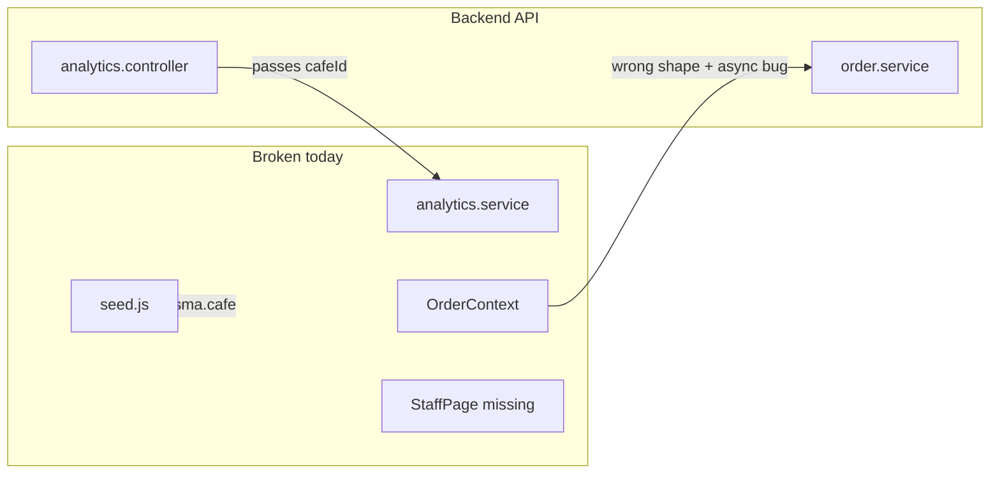

# Fix Forgotten QR Menu Issues

## Current State

The app is a **single-cafe QR menu system** with:
- **Frontend:** React + Vite (`src/`) — customer menu/cart/checkout + admin dashboard
- **Backend:** Express API (`server/src/`) — auth, menu, orders, tables, settings, analytics

The architecture is sound, but several layers were left half-migrated from a multi-tenant `cafeId` design to a single-tenant `Settings` model. That causes runtime failures in orders, analytics, seeding, and some admin pages.



---

## Phase 1 — Critical: Orders (breaks checkout + admin)

### Problem
[`server/src/services/order.service.js`](server/src/services/order.service.js) already serializes orders correctly (`id` = `orderNumber`, `total`, item `name`/`price`), but [`src/context/OrderContext.jsx`](src/context/OrderContext.jsx) **re-maps with wrong field names** (`orderNumber`, `totalAmount`, `unitPrice`) and **overwrites** valid data with `undefined`.

Additional bugs:
- `fetchOrders` calls `res.data.map()` but backend returns `{ orders, meta }` ([`order.service.js:115-123`](server/src/services/order.service.js))
- `addOrder` returns `res.data.orderNumber` → `undefined`; checkout navigates to `/order-success/undefined`
- `getOrder` / `updateOrderStatus` look up by UUID only, but URLs use `ORD-001`
- `getOrder` is **async** but [`OrderTrackPage.jsx`](src/pages/customer/OrderTrackPage.jsx) and [`OrderSuccessPage.jsx`](src/pages/customer/OrderSuccessPage.jsx) call it synchronously
- Duplicate line items (e.g. 2x espresso) rejected because `menuItems.length !== menuItemIds.length` ([`order.service.js:28-29`](server/src/services/order.service.js))

### Fix

**Backend** — add shared resolver in `order.service.js`:
```js
function orderWhere(id) {
  return { OR: [{ id }, { orderNumber: id }] };
}
```
Use in `getOrder`, `updateOrderStatus`, `deleteOrder`.

Fix duplicate-item validation: dedupe IDs before `findMany`, or compare against a `Set` of unique IDs.

**Frontend** — simplify [`OrderContext.jsx`](src/context/OrderContext.jsx):
- `fetchOrders`: use `res.data.orders` directly (backend shape is already correct)
- Remove redundant field remapping; trust `serializeOrder` output
- `addOrder`: `return res.data.id`
- `OrderTrackPage` / `OrderSuccessPage`: `await getOrder(orderId)` inside `useEffect`, with loading state
- Only poll `fetchOrders` when user is authenticated (admin), not for all customers

---

## Phase 2 — Critical: Analytics + Schema Drift

### Problem
[`analytics.service.js`](server/src/services/analytics.service.js) filters by `cafeId` on `Order`/`CafeTable`, but [`schema.prisma`](server/prisma/schema.prisma) has **no `cafeId`**. Controller passes `req.user.cafeId` ([`analytics.controller.js`](server/src/controllers/analytics.controller.js)) which is never set by [`authenticate.js`](server/src/middleware/authenticate.js).

[`seed.js`](server/prisma/seed.js) still uses `prisma.cafe`, `OWNER` role, composite `email_cafeId` keys.

Init migration ([`migration.sql`](server/prisma/migrations/20260617121803_init/migration.sql)) describes the **old** multi-tenant schema.

### Fix (per your choice: reset migrations)

1. **Replace** `server/prisma/migrations/20260617121803_init/migration.sql` with a migration matching current `schema.prisma` (`settings`, `ADMIN`/`MANAGER`/`STAFF` roles, no `cafeId`)
2. **Rewrite** [`seed.js`](server/prisma/seed.js) to seed:
   - `Settings` (id `"default"`, Brew House defaults)
   - Admin user (`admin@brewhouse.com` / `demo123`, role `ADMIN`)
   - Tables, categories, menu items (no `cafeId`)
3. **Strip `cafeId`** from all queries in [`analytics.service.js`](server/src/services/analytics.service.js)
4. **Update** [`analytics.controller.js`](server/src/controllers/analytics.controller.js) to call services without `cafeId`
5. Fix frontend endpoint mismatch in [`AnalyticsPage.jsx`](src/pages/admin/AnalyticsPage.jsx): `/analytics/category-sales` → `/analytics/categories`

---

## Phase 3 — Auth + API Client

### Problem
[`apiClient.js`](src/utils/apiClient.js) omits `credentials: 'include'`, so httpOnly refresh cookies won't be sent in production (different origins). No silent refresh on 401.

### Fix
- Add `credentials: 'include'` to all `fetch` calls in [`apiClient.js`](src/utils/apiClient.js)
- On 401 (except auth endpoints), attempt `POST /api/v1/auth/refresh` once, retry original request
- Guard open admin registration in [`auth.service.js`](server/src/services/auth.service.js): only allow `register` when `prisma.user.count() === 0` (first-setup only); return `403` otherwise

---

## Phase 4 — Admin Features Left Unwired

### Missing StaffPage (build blocker)
[`App.jsx`](src/App.jsx) imports [`StaffPage`](src/pages/admin/StaffPage.jsx) but file doesn't exist.

**Create** `src/pages/admin/StaffPage.jsx`:
- `GET /api/v1/auth/staff` — list staff
- `POST /api/v1/auth/staff` — add staff (name, email, password, role)
- Match existing admin page styling (see [`MenuManagePage.jsx`](src/pages/admin/MenuManagePage.jsx))

### Settings page is mock UI
[`SettingsPage.jsx`](src/pages/admin/SettingsPage.jsx) uses `setTimeout` fake save.

**Wire to backend:**
- Load: `GET /api/v1/settings`
- Save: `PATCH /api/v1/settings`
- Map fields: `name`, `description`, `email`, `phone`, `currency`, `taxRate`, `taxInclusive`, `acceptOrders`, `primaryColor`

### Admin menu shows only available items
[`menu.controller.js:7-10`](server/src/controllers/menu.controller.js) checks `req.user`, but [`menu.routes.js:18`](server/src/routes/menu.routes.js) has no auth on `GET /items`.

**Fix:** Add `optionalAuthenticate` middleware (sets `req.user` if valid Bearer token, continues silently if missing) on `GET /menu/items`. Refetch menu in [`MenuContext.jsx`](src/context/MenuContext.jsx) when `user` changes (login/logout).

---

## Phase 5 — Customer-Facing Polish

| Issue | File | Fix |
|-------|------|-----|
| Image preview wrong port | [`ItemModal.jsx:211`](src/components/admin/ItemModal.jsx) | Proxy `/uploads` in [`vite.config.js`](vite.config.js) → `localhost:3001`; use relative `/uploads/...` URLs |
| Search crashes on null description | [`MenuPage.jsx:34`](src/pages/customer/MenuPage.jsx) | `i.description?.toLowerCase().includes(q)` |
| Cart tax hardcoded 5% | [`CartContext.jsx`](src/context/CartContext.jsx) | Fetch public settings (add `GET /api/v1/settings/public` returning `taxRate`, `taxInclusive`, `name`, `primaryColor`) |
| Table QR not validated | [`MenuPage.jsx:17-19`](src/pages/customer/MenuPage.jsx) | Call `GET /api/v1/tables/validate/:number` before `setTable` |
| Artificial delays | `CheckoutPage`, `LoginPage`, `OrderTrackPage` | Remove `setTimeout` simulation delays |

---

## Phase 6 — Deferred (lower priority, not in initial pass)

These are stubbed but not blocking core flows:
- Analytics "Export CSV" button (no handler)
- QR code download (toast only)
- Customer header search button (no `onClick`)
- Dashboard mock trend percentages ([`DashboardPage.jsx`](src/pages/admin/DashboardPage.jsx))
- `taxInclusive` setting ignored in order total calculation

---

## Verification Plan

After fixes, manually test:

1. `cd server && npx prisma migrate reset && npm run seed` — seed runs without errors
2. Login as `admin@brewhouse.com` / `demo123` — session persists on page reload
3. Admin orders page loads list; status update works with `ORD-xxx` IDs
4. Customer: add 2x same item → checkout → lands on `/order-success/ORD-xxx` → track page shows live status
5. Analytics dashboard + analytics page load real data (no Prisma `cafeId` errors)
6. Settings save/load round-trips
7. Staff page lists and creates staff members
8. Menu manage shows unavailable items after login
